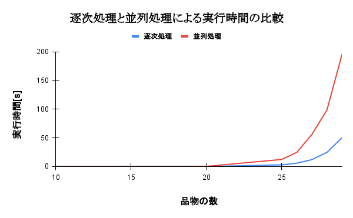

<div style="text-align: right;">
宮良一生
</div>
<div style="text-align: right;">
195755E
</div>
<div style="text-align: right;">
提出日 8/10
</div>

<div style="text-align: center;">
<h1> 並列分散処理 最終レポート </h1>
</div>

今回、ナップサック問題の並列化に挑戦した。ナップサック問題とは品物に価値と重さのパラメーターが存在し、重さが一定以下で価値が最大になる組み合わせを探す問題であり、全探索を行うと計算量が O(2^n) となる。
今回は、全探索を行い逐次処理時と並列処理時で実行時間の違いを調べた。

まず，逐次処理部で主要なコードは下記である．

```
逐次処理部のコード
	for j = 0; j < uint64(p); j++ {
		w2, v2 := calcWeight(items, j)
		if w2 <= weight {
			if v < v2 {
				w = w2
				v = v2
				bits = j
			}
		}
	}
```

次に並列処理部で主要なコードは下記である．

```
並列処理部のコード

	for j = 0; j < uint64(p); j++ {
		wg.Add(1)
		go parallelCalc(items, j, weight, &wg, &mu)
	}
	wg.Wait()

```

```
parallelCalc (一部省略)

  for i = 0; i < p; i++ {
		if shiftBits&1 == 1 {
			weight += items[i].Weight
			value += items[i].Value
		}
		if weights < weight {
			wg.Done()
			return
		}
		shiftBits = shiftBits >> 1
	}
	mu.Lock()
	if answer.v < value {
		answer.v = value
		answer.w = weight
		answer.b = bits
	}
	mu.Unlock()
	wg.Done()
```


このように逐次，並列それぞれで計算、評価を行い、価値が最大となる組み合わせを求めた。

逐次処理と並列処理の実行時間を比較したグラフが下記である。





グラフから，並列処理するよりも逐次処理を行う方が実行時間が早いことがわかった。

しかしながら，このプログラムでは効率的な並列処理を行えていない．Lock, Unlock 時に他のスレッドが操作を行っていると待機しなければならないため、無駄な時間が生じている。そこで、一度に全部計算して計算結果の中から最適な組み合わせを探す、という問題に変更すると分割統治法を使用することができるためより実行時間が短くなる可能性があると考えた。


## 参考文献
- [今までにGoでよく聞かれた質問とその参考リンク - ぷらすのブログ] https://blog.p1ass.com/posts/go-faq/
- [ソースコード] https://github.com/Issei0804-ie/parallel